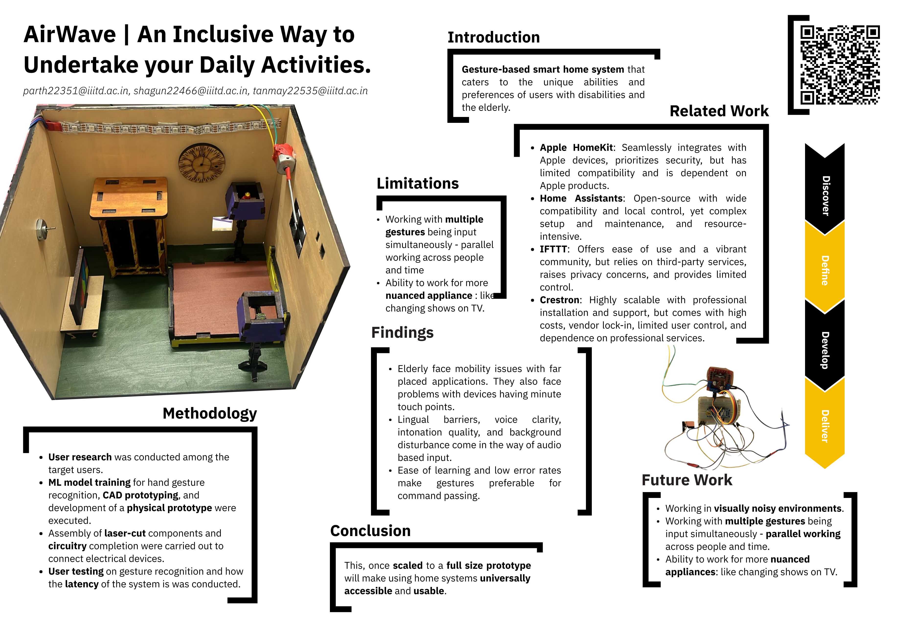

# Airwave

Airwave is a gesture-based smart home system that caters to the unique abilities and preferences of users with disabilities and the elderly made as a part of the course project for DES205: Design of Interactive Systems course conducted in Winter 2024.

[Presentation](https://drive.google.com/uc?export=download&id=1m7---9a5vpD0dbU5Acscxx16tDERc6HT)
